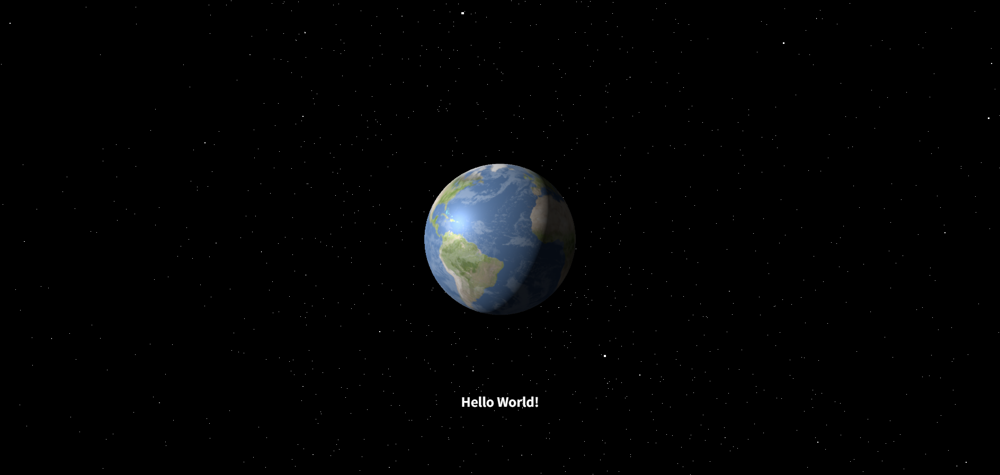

# 🌍 Earth Three.js Project

An interactive 3D Earth visualization built with Three.js, featuring realistic textures, clouds, stars, and smooth animations.

## 📺 Tutorial

This project is based on the [Three.js Sphere Tutorial](https://www.youtube.com/watch?v=_OwJV2xL8M8) with additional enhancements to create a realistic Earth visualization.

### Prerequisites

- Node.js installed
- npm or yarn package manager
